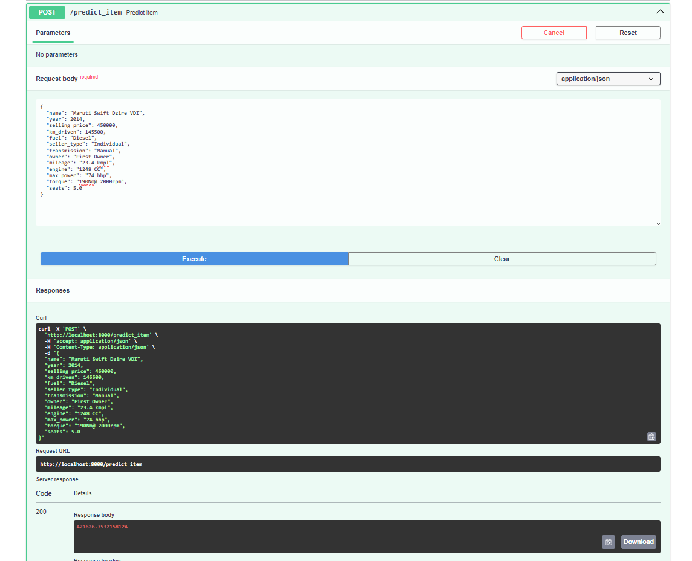
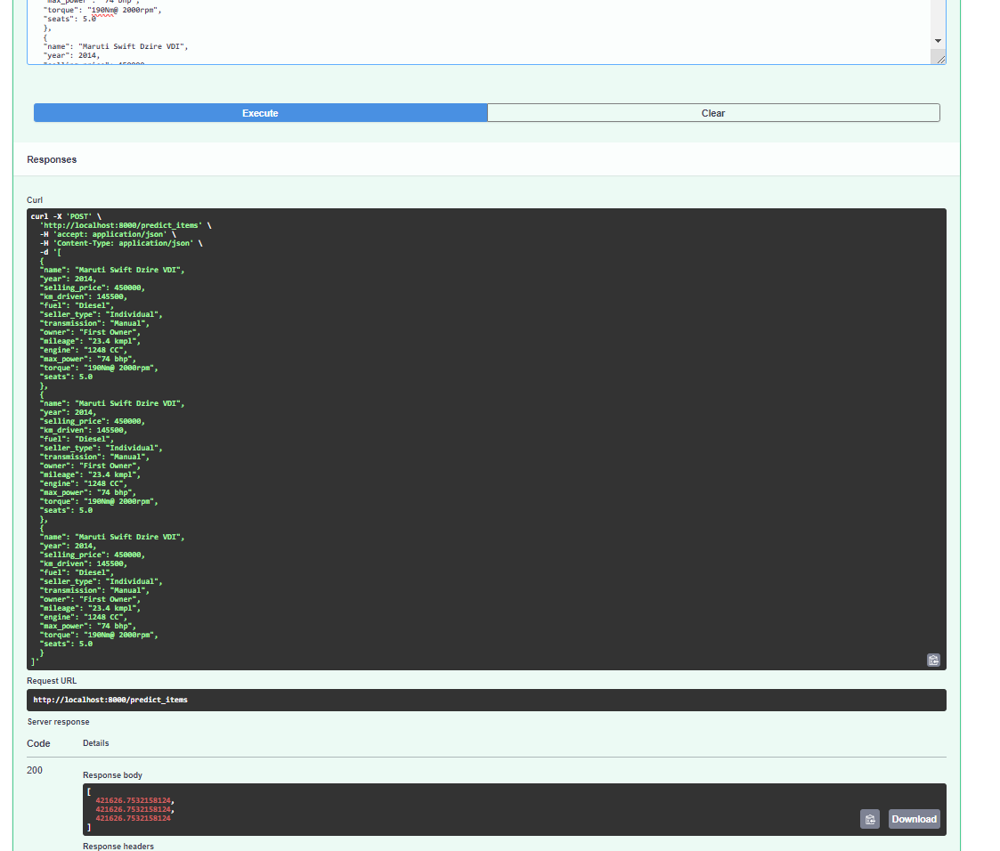

# HW1_Regression_with_inference

**Описание:** 
Сервис для предсказания цены на автомобиль по его характеристикам 

**Метод:** 
Модель линейной регрессии c L2 регуляризацией

**Лучшая практика:** 
Добавление и генерирование новых признаков

**Метрики:** 
r2 - 0.7152 
Доля предиктов, отличающихся от реальных цен на эти авто не более чем на 10%: 
0.242

**Пример работы сервиса:** 
- Метод predict_item: 

- Метод predict_items: 

